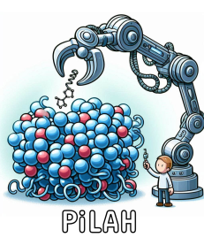
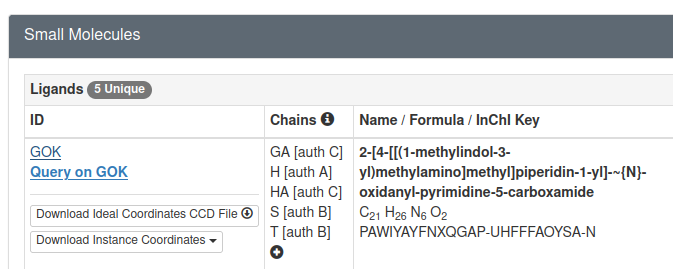
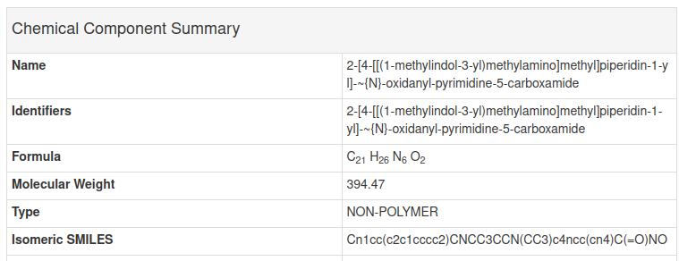
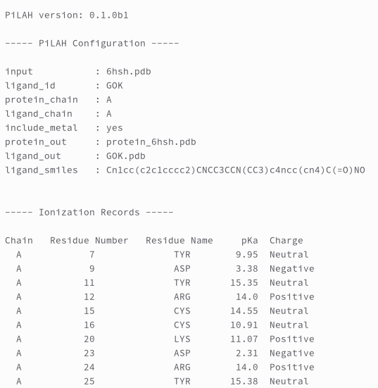

# PiLAH

<p align="center">
  
</p>

PiLAH stands for *Protein Ligand Abstraction and Hydrogenization tool*.
It is a cheminformatic tool that separate protein and ligand from the PDB file, fix the bond order of the ligand, protonate protein and ligand separately, then write them to separate file. It combines the power of Biopython, RDKit, Meeko, and Openbabel for the general cheminformatics processing, and it also combines the power of Dimorphite-DL and pKAI for small molecule and protein pKa prediction.

It generates ligand in PDB, MOL2, SDF, and PDBQT format.
And it generates protein in PDB, MOL2, and PDBQT format.
Optionally it could also generate the 2D representation of the ligand for easier inspection i.e. if you would like to know the protonation state and which moieties are protonated or deprotonated.

## Installation

Download the binary release from the release page then extract it.
In the extracted folder you will find an executable file named with `pilah` and
an example folder which contain configuration and input files for the following
usage guidelines.

You can execute PiLAH directly from the extraction folder as such:

`./pilah --help`

It is highly recommended to copy PiLAH to one of your executable path.
You can check your available executable path by running the command `echo $PATH`.
Some path that you can use are `/home/$USER/.local/bin` or `usr/local/bin`.

After copying PiLAH to your executable path, go to PiLAH's example directory and run
PiLAH again:

`pilah --help`

If it runs properly, the next step is to run PiLAH using one of the provided example.
Still in the example directory run PiLAH with the following command:

`pilah run config_pdb_hux.txt`

Normally it will take between 5-15 seconds for PiLAH to complete the protein ligand extraction and protonation.
After PiLAH finished the processing, PiLAH will generate four files.
One for the isolated protein molecule, `protein_1e66.pdb`.
Second one for the extracted ligand molecule, `HUX.pdb`.
Third one for the ligand image in 2D representation, `HUX.png`.
The last one for the log file which is named with the date and time when PiLAH was executed, such as `log_20240815_172113.txt`

Now PiLAH is ready to be used on your system.

## Getting Started

To get started we will use the crystal structure of HDAC8 complexed with Quisinostat (PDB ID: 6HSH).

### Mandatory Options

The PDB file of this structure is already included in the examples folder.
To extract the protein and the ligand from the PDB file we will need a configuration file that **must contain** the following mandatory options:

1. `input` : the PDB file name
2. `ligand_id` : the residue name of the ligand inside PDB file
3. `protein_out` : the output filename for the protein
4. `ligand_out` : the output filename for the ligand

There are four example configuration file that we can use to process the HDAC8-Quisinostat complex.
First we will use the `config_pdb_gok.txt` configuration file.

```text
input = 6hsh.pdb
ligand_id = GOK
include_metal = yes
protein_out = protein_6hsh.pdb
ligand_out = GOK.pdb
ligand_image = GOK.png
image_size = large
ligand_smiles = Cn1cc(c2c1cccc2)CNCC3CCN(CC3)c4ncc(cn4)C(=O)NO
ph = 7.4
```

The `input`, `protein_out`, and `ligand_out` are self-explanatory.
The `ligand_id` option assigned with `GOK` which is the residue name of Quisinostat as can be seen in [the PDB page of HDAC8-Quisinostat complex](https://www.rcsb.org/structure/6HSH).

### Optional Options

Other than the four mandatory options above, there are optional options:

1. `include_metal` : include metal as part of the extracted protein structure. Only accept `yes` and `no` value, the default is `no`.
2. `ligand_image` : the image file name for ligand 2D representation
3. `image_size` : the image size of the ligand image (explained below)
4. `ligand_smiles` : The SMILES of the ligand. Providing this will serve as the molecule template for the ligand which can be used to make sure every bond order in the ligand correctly assigned.
5. `ph` : the pH value for determining the protonation state of ligand and protein residues. When not provided, the default value is 7.4.

One thing to note about the optional options above is how to get the ligand SMILES.
Ligand SMILES for the ligand can be retrieved from the corresponding PDB page, specifically in `Small Molecules` section.
And as can be seen below there is a link for GOK:

<p align="center">
  
</p>

If we open the link above we can find the SMILES for Quisinostat in `Chemical Component Summary` table

<p align="center">
  
</p>

As we can see the SMILES in the GOK page above is the same as the SMILES in the configuration file above.
Next, lets try extracting the protein and ligand from PDB file using the configuration file above and analyze the result.

### Running PiLAH and Analyze the Results

In the `examples` directory execute `pilah run config_pdb_gok.txt`, or if you have not copied PiLAH into your executable path as instructed on `Installation` instruction above you can run PiLAH directly from the higher directory using the command `../pilah run config_pdb_gok.txt`.

After PiLAH finished running there should be four files generated:
1. `protein_6hsh.pdb` : The structure of HDAC8 chain A.
2. `GOK.pdb` : The structure of Quisinostat chain A.
3. `GOK.png` : The 2D representation of extracted and protonated Quisinostat.
4. `log_20240816_210348.txt` : The log file which contain the configuration being set up and the ionization records for each ionizable residue of the protein.

Notice that the structures are retrieved from chain A.
By default PiLAH will select chain A when multiple chain available, it is possible to select other chain as explained below in Advanced Usage section.

Other than the structure we can also view the 2D representation using the `ligand_image` option, which generate the following image

<p align="center">
  
</p>

By inspecting the image we can immediately figure out the protonation state of each ionizable moiety. In the image above we can see that the dimethylamino moiety get protonated at pH 7.4, if you are curious you could re-run this example after modifying the pH value to 9.4 and see the difference.

Last but not least, the log file contain important information about the PiLAH version, configuration, and ionization records:

<p align="center">
  
</p>

`Ionization records` is a list of ionizable protein residues with its predicted pKa value and charge.
According to the author of pKAI there are four possibly negatively charged residues (ASP, GLU, CYS, TYR) and three possibly positively charged residues (LYS, ARG, HIS).
However it is important to note that the ARG residue considered to be always positively charged and therefore not calculated by pKAI.
So we deliberately decided to include ARG in ionization records and assign 14.0 as the pKa value and the charge is always `Positive`.
And we gave the same treatment with any metal ion.

Therefore, behind the scene pKAI will calculate the pKa for all ionizable residues except ARG. And then as general rule, for ASP, GLU, CYS, and TYR, ionizable residues will be neutral when the pH below the pK, else they will be negatively charged when the pH above the pK. For LYS, ARG, and HIS, ionizable residues will be neutral when the pH above the pK, else they will be positively charged when the pH below the pK. And as general rule, the ionizable residues only get ionized when the pH-pK difference is 1 unit or more.
This difference can be set up with `ptreshold` option as explained in Advanced Usage below. 

## Various Options and Advanced Usage

See Documentation for more details.

## Contributing

Interested in contributing? Check out the contributing guidelines. Please note that this project is released with a Code of Conduct. By contributing to this project, you agree to abide by its terms.

## License

`PiLAH` was created by Muhammad Radifar and Enade Perdana Istyastono. It is licensed under the terms of the Apache License 2.0 license.

## Credits

`PiLAH` was created with [`cookiecutter`](https://cookiecutter.readthedocs.io/en/latest/) and the `py-pkgs-cookiecutter` [template](https://github.com/py-pkgs/py-pkgs-cookiecutter).
