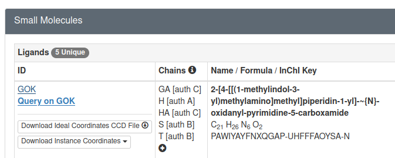
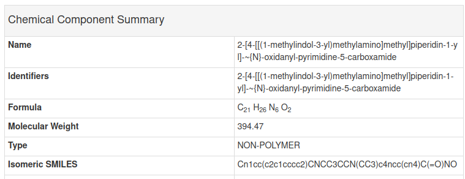
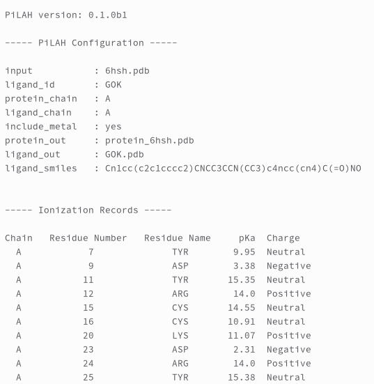

# Getting Started

To get started we will use the crystal structure of HDAC8 complexed with Quisinostat (PDB ID: 6HSH).

---
## Mandatory Options

The PDB file of this structure is already included in the examples folder.
To extract the protein and the ligand from the PDB file we will need a configuration file that **must contain** the following mandatory options:

1. `input` : the PDB file name
2. `ligand_id` : the residue name of the ligand inside PDB file
3. `protein_chain` : The chain ID of the selected protein
4. `ligand_chain` : The chain ID of the selected ligand
5. `ligand_smiles`: The SMILES of the ligand, which will be used as the molecule template for the ligand to make sure every bond order in the ligand correctly assigned.
6. `protein_out` : the output filename for the protein
7. `ligand_out` : the output filename for the ligand

First we will use the `config_pdb_gok.txt` configuration file.

:::{card}
:class-header: sd-px-1 sd-py-1

config_pdb_gok.txt
^^^
```text
input = 6hsh.pdb
ligand_id = GOK
protein_chain = A
ligand_chain = A
include_metal = yes
protein_out = protein_6hsh.pdb
ligand_out = GOK.pdb
ligand_smiles = Cn1cc(c2c1cccc2)CNCC3CCN(CC3)c4ncc(cn4)C(=O)NO
```
:::

The `input`, `protein_out`, and `ligand_out` are self-explanatory.
The `protein_chain` and `ligand_chain` options are for selecting the chain ID.
The chain ID option for protein and ligand have to be provided separately because there are many cases where the protein and the ligand were located at different chains.
The `ligand_id` option assigned with `GOK` which is the residue name of Quisinostat as can be seen in [the PDB page of HDAC8-Quisinostat complex](https://www.rcsb.org/structure/6HSH).

Ligand SMILES for the ligand can be retrieved from the corresponding PDB page, specifically in `Small Molecules` section.
And as can be seen below there is a link for GOK:

<p align="center">
  
</p>

If we open the link above we can find the SMILES for Quisinostat in `Chemical Component Summary` table

<p align="center">
  
</p>

As we can see the SMILES in the GOK page above is the same as the SMILES in the configuration file above.
Next, lets try extracting the protein and ligand from PDB file using the configuration file above and analyze the result.

---
## Optional Options

Other than the seven mandatory options above, there are optional options:

1. `include_metal` : include metal as part of the extracted protein structure. Only accept `yes` and `no` value, the default is `no`.
2. `ligand_image` : the image file name for ligand 2D representation
3. `image_size` : the image size of the ligand image (explained below)
4. `ph` : the pH value for determining the protonation state of ligand and protein residues. When not provided, the default value is 7.4.
5. `ptreshold`: the minimum difference between pH and pKa to allow the ionizable residues to be ionized. The default is 1.0
6. `pkai_model`: the pKa model that will be used by pKAI, the default is pKAI
7. `ligand_res_num`: selected ligand residue number when multiple ligand with the same ID exist in one chain.
8. `alt_loc`: selected alt loc id for disordered residue.

Many of these optional options will be explained in details in [Various Use Cases](usecases).

---
## Running PiLAH and Analyze the Results

In the `examples` directory execute `pilah run config_pdb_gok.txt`, or if you have not copied PiLAH into your executable path as instructed on [installation](installation) instruction above you can run PiLAH directly from the higher directory using the command `../pilah run config_pdb_gok.txt`.

After PiLAH finished running there should be three files generated:
1. `protein_6hsh.pdb` : The structure of HDAC8 chain A.
2. `GOK.pdb` : The structure of Quisinostat chain A.
3. `log_20240816_210348.txt` : The log file which contain the configuration being set up and the ionization records for each ionizable residue of the protein.

Last but not least, the log file contain important information about the PiLAH version, configuration, and ionization records:

<p align="center">
  
</p>

`Ionization records` is a list of ionizable protein residues with its predicted pKa value and charge.
According to the author of pKAI there are four possibly negatively charged residues (ASP, GLU, CYS, TYR) and three possibly positively charged residues (LYS, ARG, HIS).
However it is important to note that the ARG residue considered to be always positively charged and therefore not calculated by pKAI.
So we deliberately decided to include ARG in ionization records and assign 14.0 as the pKa value and the charge is always `Positive`.
And we gave the same treatment with any metal ion.

Therefore, behind the scene pKAI will calculate the pKa for all ionizable residues except ARG. And then as general rule, for ASP, GLU, CYS, and TYR, ionizable residues will be neutral when the pH below the pK, else they will be negatively charged when the pH above the pK. For LYS, ARG, and HIS, ionizable residues will be neutral when the pH above the pK, else they will be positively charged when the pH below the pK. And as general rule, the ionizable residues only get ionized when the pH-pK difference is 1 unit or more.
This difference can be set up with `ptreshold` option as explained in [Various Use Cases](usecases).

---
## Generating 2D representation of the ligand

We can also view the 2D representation by adding the `ligand_image` and `ligand_size` option to `config_pdb_gok.txt` as shown in the following config file:

:::{card}
:class-header: sd-px-1 sd-py-1

config_pdb_gok.txt
^^^
```text
input = 6hsh.pdb
ligand_id = GOK
protein_chain = A
ligand_chain = A
include_metal = yes
protein_out = protein_6hsh.pdb
ligand_out = GOK.pdb
ligand_image = GOK.png
image_size = large
ligand_smiles = Cn1cc(c2c1cccc2)CNCC3CCN(CC3)c4ncc(cn4)C(=O)NO
ph = 7.4
```
:::

which generate image file `GOK.png`:

<p align="center">
  
</p>

By inspecting the image we can immediately figure out the protonation state of each ionizable moiety. In the image above we can see that the dimethylamino moiety get protonated at pH 7.4, if you are curious you could re-run this example after modifying the pH value to 9.4 and see the difference.

---
## What is next?

The example that we use above should cover most of your need.
For other use cases, such as how to generate other molecule format, how to use different protonation model or environment, and so on please check [how to use PiLAH in various use cases](usecases).