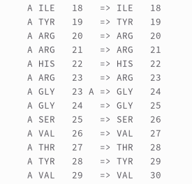
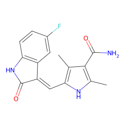
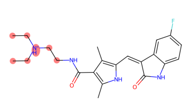

# Various Use Cases

## Various Output Formats

PiLAH support PDB, MOL2, SDF, and PDBQT format for ligand, but only PDB, MOL2, and PDBQT for protein.
This is due to the fact that SDF format is not suitable for macromolecule.

Few things to note:
1. All the format is originally derived from PDB that is processed with Biopython and RDKit.
2. SDF format is also generated using RDKit.
3. MOL2 format is generated using Openbabel.
4. PDBQT format is generated using Meeko. **The caveat** is the tyrosine in PDBQT is always neutral as deprotonated tyrosine can not be recognized by Meeko.

To choose the output format you can simply assign the extension to the file name (only in lower-case such as `.pdb`, `.sdf`, `.mol2`, `.pdbqt`) for `protein_out` and `ligand_out` option. Check out the configurations that uses various output format in the `examples` directory.

Also note that the protein and ligand output format are not necessarily the same.

---
## 2D Ligand Image Format and Size

### Image Format
There are two supported output format for 2D representation, SVG and PNG.
To choose the output format you can simply assign the extension to the file name (only in lower-case such as `.png` or `.svg`) for `ligand_image` option.

### PNG Image Size
For PNG format we can choose one of the predefined image size that can be assigned to `image_size` option.
The default size is `small`, which can vary depending on the 2D representation of the molecule.
The other two are `medium` (420x420 pixel) and `large` (640x640 pixel).

---
## Dealing with Problematic Residues

As there are various difficulties and anomalies in structure determination, the PDB file may lack information or having inaccurate results.
This section will describe how PiLAH deal with such issues.

### Missing Residues

Ideally missing residues should be built to complete the protein structure.
And this is especially true for MD simulation.
But such approach require a lot of resource and consideration, therefore PiLAH will simply let them be.

If you would like to use the complete protein structure you have to fix the protein using other tool
such as [PDBFixer](https://github.com/openmm/pdbfixer), SwissPDBViewer, [Pras_Server](https://github.com/osita-sunday-nnyigide/Pras_Server/) before using the structure as PDB input for PiLAH.

### Residues with Missing Atoms

Residues with Missing Atoms will be deleted and act like Missing Residues.

### Residues with Incorrect Bond Length and Bond Angle

Residues with incorrect bond length and bond angle will be matched against the SMARTS pattern of its corresponding residue side chain.
If they don't match then there could be incorrect bond order and they can not be further processed.
Therefore such residues will be deleted.

---
## Dealing Protein with Insertion Code

Some PDB file may contain [insertion codes](https://proteopedia.org/wiki/index.php/Unusual_sequence_numbering#Multiple_Residues_with_the_Same_Number), which is a way to maintain the residue number to match the reference protein.
And it is undesireable to use such PDB file as many Cheminformatics tool/library can not differentiate two residue with the same chain ID and residue number.
For example pKAI and Meeko -- that PiLAH rely on -- use chain ID and residue number combination as the residue ID, therefore leaving the PDB file with insertion code could lead to incorrect result.

To avoid any problem in the protein processing PiLAH will renumber the residue so there could be no residues with the same chain ID and residue number combination. For example, the structure of Urokinase-type Plasminogen Activatior (UPA for short) in PDB ID 1SQT contain a single residue insertion at residue number 24. Using the following configuration from PiLAH:

:::{card}
:class-header: sd-px-1 sd-py-1

config_pdbqt_ui3.txt
^^^
```text
input = 1sqt.pdb
protein_out = protein_1sqt.pdbqt
ligand_out = UI3.pdbqt
protein_chain = A
ligand_chain = A
ligand_id = UI3
ligand_smiles = [H]/N=C(/c1ccc2ccc(c(c2c1)c3cnn(c3)S(=O)(=O)C)OC)\N
include_metal = yes
ligand_image = UI3.png
image_size = large
```
:::

Running the config above will generate `protein_1sqt.pdbqt with renumbered residue from residue 24 onwards.
And the residue number mapping will be logged into the log file below the ionization records:

<p align="center">
  
</p>

---
## Selecting Multichain protein

Sometimes protein-ligand complex formed between one ligand and two protein chain.
This could happen when the binding site of the ligand is at the interface of protein-protein complex.
To analyze such complex PiLAH allows user to select more than one protein chain.
Fortunately pKAI is also capable of calculating the pKa of multichain protein.

The multichain selection can be done by providing the multiple chain separated by space in the `protein_chain` option as shown in the config file `config_pdbqt_4hi_multichain` below:

:::{card}
:class-header: sd-px-1 sd-py-1

config_pdbqt_ui3.txt
^^^
```text
input = 3ccw.pdb
protein_out = protein_3ccw_multi.pdbqt
ligand_out = 4HI.pdbqt
protein_chain = A B
ligand_chain = B
ligand_id = 4HI
ligand_smiles = CC(C)c1c(nc(n1CC[C@H](C[C@H](CC(=O)O)O)O)c2ccc(cc2)F)C(=O)NCc3ccccc3
include_metal = yes
ligand_image = 4HI.png
image_size = large
```
:::

---
## Selecting Ligand When Multiple Ligand Exist

When multiple ligand with same ID exist in one chain PiLAH will automatically select the ligand with the lowest residue number, it will also warn you that there are multiple ligand in the selected chain and provide the residue number of the ligands so that you can select one of the ligand using `ligand_res_num` if you have to.
To select the ligand with other residue number we have to use the `ligand_res_num` as shown in config file `config_pdbqt_4hi_ligand_resnum_2`:

:::{card}
:class-header: sd-px-1 sd-py-1

config_pdbqt_ui3.txt
^^^
```text
input = 3ccw.pdb
protein_out = protein_3ccw.pdbqt
ligand_out = 4HI_2.pdbqt
protein_chain = A
ligand_chain = B
ligand_id = 4HI
ligand_res_num = 2
ligand_smiles = CC(C)c1c(nc(n1CC[C@H](C[C@H](CC(=O)O)O)O)c2ccc(cc2)F)C(=O)NCc3ccccc3
include_metal = yes
ligand_image = 4HI.png
image_size = large
```
:::

---
## Dealing with Not Matching Ligand SMILES

There are cases when the ligand SMILES can not match the ligand coordinate extracted from the PDB file.
In this kind of mismatch, usually it happens because the ligand SMILES contain hydrogens to justify its stereochemistry.
Thus, PiLAH will force removing the hydrogens from the template so that it could match with the ligand coordinate from PDB file.

In rare case, there is a possiblity of missing atoms in ligand residue, such as the ligand B49 in PDB 3g0e.
When this happen, PiLAH will try to find the match as much as it can and assign bond order from the substructure of the template.
At the same time PiLAH will generate an image file that shows which atoms are missing from the ligand by referencing the ligand SMILES.

This can be demonstrated by running the config file `config_pdbqt_b49.txt`.
In the output we will get the ligand coordinate output `B49.pdbqt`, the 2D image of the ligand output `B49.png`, and the 2D image of the ligand SMILES with highlight on missing atoms `B49_missing_atoms.png`.

<p align="center">
  </br>
  B49.png
</p>

<p align="center">
  </br>
  B49_missing_atoms.png
</p>

---
## Alternative Location
In cases where a structure contain disordered residues PiLAH can be used to select one of the `alt_loc`.
Usually a bioinformatics or cheminformatics tool will select `alt_loc` **A** even though that each `alt_loc` have the same occupancy.
When it comes to molecular docking, the `alt_loc` of some residues or even ligand may matter.
Therefore PiLAH allows the selection of `alt_loc` for each individual ligand as each `alt_loc` is [independent to each other](https://proteopedia.org/wiki/index.php/Alternate_locations).

For example, in config file `config_pdbqt_fap_altloc_ligand.txt` we can see the following line:

```text
altloc = B:A63ILE B:A89LYS B:A145ASP
```

Here three residues are selected, each selection constructed with the following format: `{alt_loc_id}:{chain_id}{residue_number}{residue_name}`.
In this example we use the alt_loc id B for every selected residue.
If we run this config file we will use alt_loc id B for those residues and alt_loc id A for the rest disordered residues in the structure.

---
## Protonation

### pKAI Model

pKAI comes with two model `pKAI` and `pKAI+`.
By default PiLAH will use `pKAI` model as the author states that it outperform all other model when it comes to determining the protonation state at biologically relevant pH values. To switch the model to `pKAI+` you can use the following configuration:

```text
pkai_model = pKAI+
```

### pH

By default the protonation is calculated using pH 7.4.
To change the pH value you can assign it to option `ph` like so:

```text
ph = 6.8
```

### ptreshold (protein only)

Protonation is done separately for ligand and protein.
The ligand structure is protonated directly using Dimorphite-DL by providing the ligand SMILES and the pH value.
While the protein structure protonation is determined by the pKa value prediction using pKAI.
The ionizable residue will be ionized if the pH-pKa difference is equal or higher than ptreshold, which by default is assigned with `1`.
ptreshold can be modified by assigning preferred value to it like so:

```text
ptreshold = 1.2
```