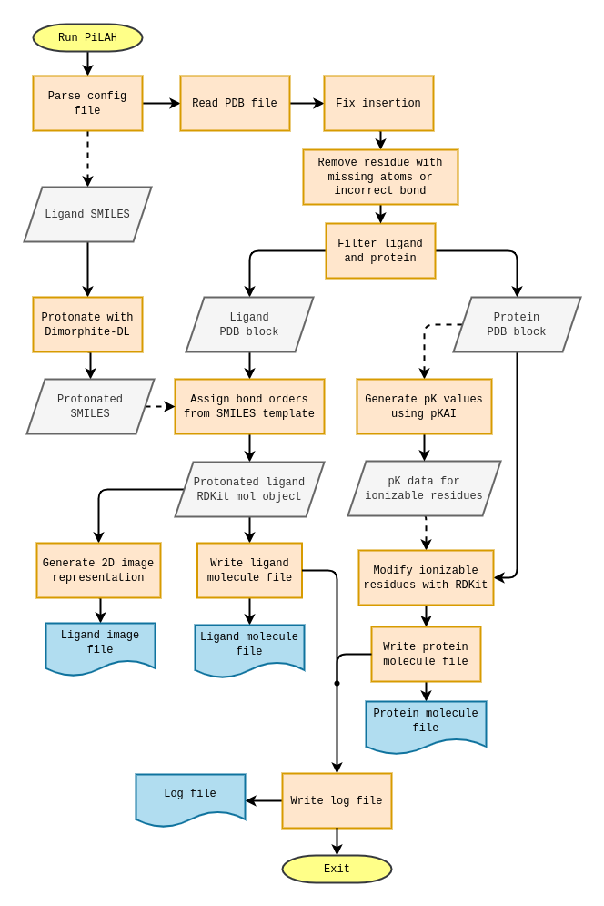
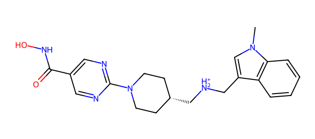

# Summary

PiLAH is a command-line tool for protein-ligand extraction and protonation. Given a PDB file, PiLAH will extract the chain and residues of interest, assign bond order to the ligand using SMILES as the template, and finally it will determine the protonation states of both protein and ligand. The resulting protein and ligand structure will be written in PDB, MOL2, SDF (ligand only), or PDBQT format. PiLAH will also generate a log file which contain the calculated pK value for each ionizable amino acid residue and the resulting charge at the selected pH. In some cases the log file may contain additional information regarding the protein processing, such as the removal of  residues with missing atoms, residue renumbering when insertion code detected, etc. Optionally PiLAH could also generate the 2D representation of the ligand structure so that the user could inspect the protonation states of the ionizable moieties in the ligand. PiLAH is written in Python 3 and it utilize the Biopython, RDKit, Meeko and Openbabel for cheminformatics processing, it also utilize Dimorphite-DL and pKAI to predict the protonation states of the ligand and the protein respectively. PiLAH is developed to make the protein and ligand preparation simple without the need to use programming language or learning how to use a couple or more cheminformatics tools.

# Statement of need

The protein structure retrieved from PDB repository may contain many molecules apart from the molecule that we are interested in, such as water, salt, organic solvent, buffer molecule, etc. Therefore, extracting the protein and the ligand from a PDB file is a common practice prior to molecular modeling or molecular simulation study. There are three commonly used approach in doing this, the first one is by opening the PDB file containing the complex structure of interest using GUI-based molecular visualization tool such as VMD, Pymol or Chimera, then saving the atom coordinates of the selected molecules. The second approach is by manually filtering the line that contain the atom of interest using 'grep' or 'awk' command. Then the last one is by using cheminformatics library (e.g. ProDy and Biopython) to select the molecule of interest and save them into molecular structure files.

The forementioned approach requires considerable amount of learning, especially the last one where you have to at least mastering the basic level of the programming language, and you also have to learn the basic workflow of the cheminformatics library. To simplify the protein-ligand extraction and preparation it is possible to create or use a simple script or program that could filter and retrieve the chain or compound of interest, assign the bond order and protonate them on the fly. As an example SPORES [@ten2010pk] can split PDB files into protein, ligands, and waters, assign the bond order and protonate them, and finally write them in MOL2 format. However there are four limitation that comes with SPORES. First, it is a closed source tool. Second, it can only generate MOL2 format. Third, the protonation model is simple and only validated using virtual screening of the generated MOL2 formatted protein and ligand. And the fourth one is a common problem among cheminformatics tools, which is the accuracy of the bond order assignment.

PiLAH inspired by SPORES and developed as open source tool. It is designed to generate various file format mainly to address the requirement of free or open source docking tools i.e. AutoDock VINA, PLANTS, GNINA. To determine the protonation states of the ligand and the protein it uses Dimorphite-DL [@ropp2019dimorphite] and pKAI [reis2022fast] respectively. Both of these library were chosen because they have been validated using experimental pK values. Specifically, pKAI have comparable accuracy when matched against PypKa and PROPKA, and it is also considerably faster compared to PypKa. Using separate library for the pKa prediction of protein and ligand is definitely better as each library will use the pKa model suitable for each domain. Finally the bond order will be assigned to ligand coordinates extracted from PDB using the Dimorphite-DL as the template. By integrating several cheminformatics library, PiLAH could simplify the protein-ligand extraction and protonation workflow.

Another issue that PiLAH try to address is the complexity of the experimental structure which includes:

1. The missing atoms in protein residue: In this case PiLAH will remove the residues as such residue can not be processed further by downstream cheminformatics tools, such as pKAI and Meeko.
2. Incorrect bond length or angle in residue: PiLAH will treat such residue like residue with missing atoms.
3. Insertion code: Some residues may contain insertion code which may create duplicate residue ID (usually pair of chain ID and residue number) in many cheminformatics tools. Therefore PiLAH will try to renumber the residues with insertion code and all the residues after such residues. The mapping between old residue ID and the new residue ID will be written in log file.
4. Alternate location (altlocs): Using PiLAH it is possible to select the altlocs individually for each residue as altlocs for each residues are independent from each other.
5. Selecting multiple chain of protein: Sometimes ligand binding site is located at the interface between two chain of protein. In such case we can define multiple chain selection in the configuration file.
6. Selecting ligand by residue number: There are cases where multiple ligand with the same ID were located at the same chain. PiLAH will only select one of the ligand, preferably the one with the lowest residue number. But user can also select the other residue number.
5. The missing atoms in ligand residue: PiLAH would try to match as many as possible, the atom of the 3D ligand coordinate to the SMILES template. Then PiLAH will assign the bond based on the templates and inform users which atoms are missing by generating an image file of the template with missing atoms highlighted.

Addressing these complexities will allow researcher to focus on the real problem and it will open the path to exploit problematic structures in structure-based virtual screening study.

# PiLAH workflow

As PiLAH try to summarize and automatize protein and ligand preparation workflow there are many steps involved inside PiLAH. These steps can be captured in the following flowchart diagram.



# Availability, usage and documentation

PiLAH is available both as source code and executable at the [Github page of PiLAH](https://github.com/radifar/pilah). At the moment the executable only available for Linux OS. As a command line tool PiLAH can be run by providing the following configuration example
`config_pdb_gok.txt`

```
input = 6hsh.pdb
ligand_id = GOK
protein_chain = A
ligand_chain = A
include_metal = yes
protein_out = protein_6hsh.pdb
ligand_out = GOK.pdb
ligand_smiles = Cn1cc(c2c1cccc2)CNCC3CCN(CC3)c4ncc(cn4)C(=O)NO
```

and run the following command

`pilah run config_pdb_gok.txt`

This command will instruct PiLAH to read the configuration file and look for 6hsh.pdb file, extract the protein and ligand as specified in the configuration, then it will protonate the protein and ligand and write the protein and ligand as specified in `protein_out` and `ligand_out` options.

PiLAH can also generate 2D image representation of the generated ligand for easier inspection by adding the following lines to the configuration file above

```
ligand_image = GOK.png
image_size = large
```
After running it again, PiLAH will generate the following image

.

More information on how to use PiLAH are available on its documentation.

# Development notes

PiLAH is developed with Python 3.10 in a Mamba environment, using Poetry as package dependency management tool. It has been tested using Pytest with various experimental data from RCSB PDB.

PiLAH is packaged as executable using PyInstaller. PiLAH executable size is relatively huge (more than 300 MB) because it contains Torch library which is required by pKAI, this library alone occupy more than 600 MB when it is not compressed.

# Acknowledgements

The authors thank ... for the financial support.

The authors also acknowledge the developers of the tools or libraries used as dependencies of PiLAH, especially the following dependencies:

1. Biopython [@cock2009biopython]: protein-ligand extraction, residue renumbering
2. RDKit [@rdkit]: molecule conversion, bond assignment, and molecule modification (protonation and deprotonation)
3. Openbabel [@o2011open]: molecule conversion to MOL2
4. Meeko [meeko]: molecule conversion to PDBQT
5. pKAI [@reis2022fast]: pKa model for ionizable residues of protein
6. Dimorphite-DL [@ropp2019dimorphite]: protonation of small molecule
7. PyInstaller [@pyinstaller]: bundling as executable file

# References


